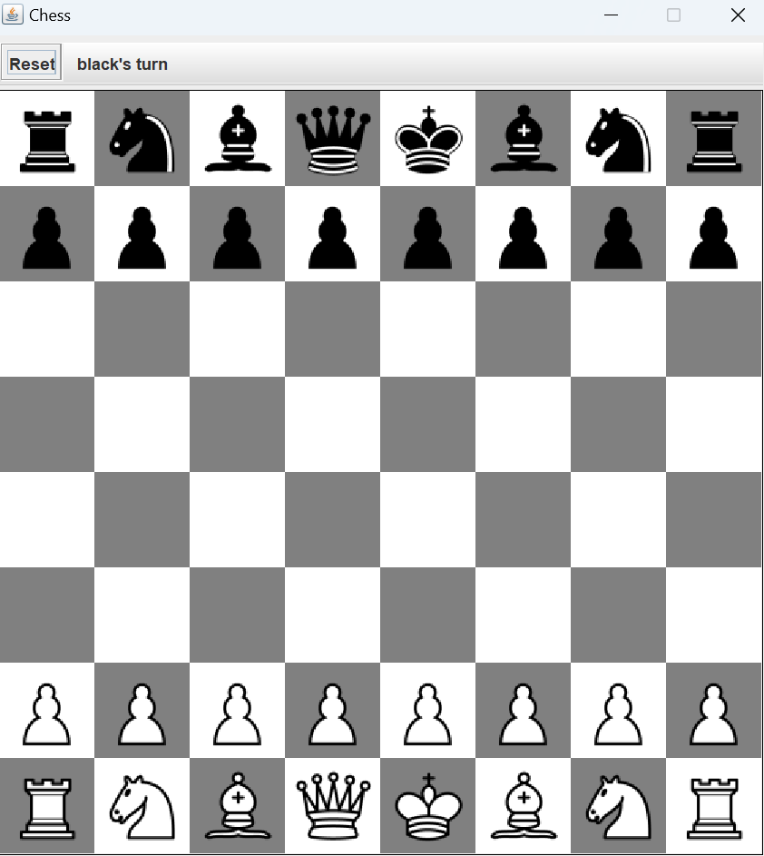
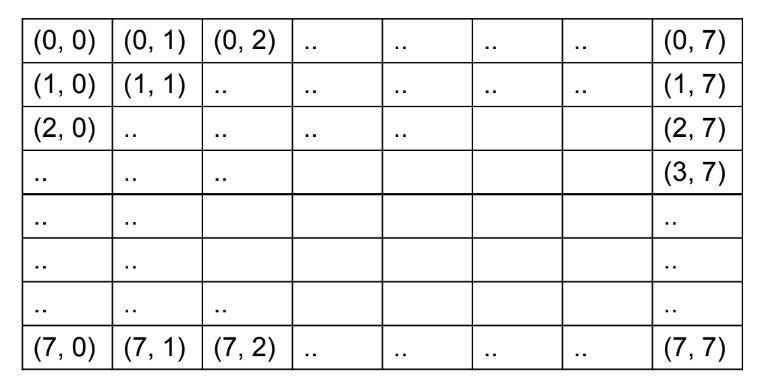

# Java Chess Game Project

## Overview
A Java-based chess game for two players, featuring a graphical user interface and enforcing standard chess rules.

## Initial Game State:



## Features
- **Graphical User Interface:** A simple and intuitive GUI for user interaction.
- **Board Initialization:** The chessboard initializes with pieces in the standard starting positions.
- **Piece Movement:** Players can move pieces by clicking on the board's squares.
- **Game Status:** The application includes a status bar to indicate which player's turn it is and to display messages like "Check" or "Checkmate".
- **Reset Functionality:** A reset button allows players to start a new game at any point.

## Getting Started
### Prerequisites
- Java Runtime Environment (JRE) or Java Development Kit (JDK)

### Running the Application

1. Compile the ChessBoard.java file:
    ```bash
    javac ChessBoard.java
    ```

2. Run the compiled class:
    ```bash
    java ChessBoard
    ```

## Gameplay Guide

- **Selecting Pieces:** Click on a piece to see possible moves highlighted.
- **Making Moves:** Click on a highlighted square to move the selected piece.
- **Check/Checkmate Detection:** The game automatically detects and announces check and checkmate scenarios.
- **Turn Notification:** Each player's turn is clearly indicated.

## Behind the Scenes
- **Board Representation:** An 8x8 grid of buttons represents the chessboard.

- **Piece Representation:** Each piece is an instance of the Piece class with a type and color.
- **Game Logic:** Custom methods define the rules for piece movement and capture.
- **Endgame Conditions:** The game detects stalemate, check, and checkmate conditions, concluding the game accordingly.

## Extending the Game
- **Customization:** The GUI can be customized with different themes or piece sets.
- **Enhancements:** Additional features like move history, undo/redo, and AI opponents can be added.

*Visit the repository for the complete code and more information.*